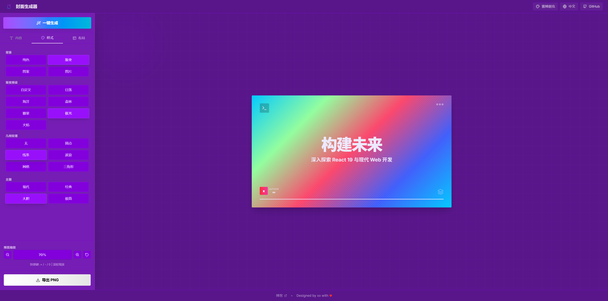

# 封面生成器 (Cover Generator)

一个功能强大、设计精美的技术封面生成器，支持实时预览、多种主题、自定义文本和背景配置。基于 React 19 + TypeScript + Vite 构建，提供专业级的封面图片制作体验。



## ✨ 主要特性

### 🎨 多样化主题设计
- **Modern**: 现代简约风格，适合技术博客和演示
- **Classic**: 经典商务风格，专业大气
- **Bold**: 大胆醒目风格，冲击力强
- **Minimal**: 极简主义风格，干净优雅

### 🎭 丰富的背景效果
- **纯色背景**: 自定义任意颜色
- **渐变背景**: 6种精选渐变预设 (Sunset, Ocean, Forest, Candy, Aurora, Flame)
- **几何图案**: 5种几何纹理 (Grid, Dots, Lines, Waves, Triangles)
- **背景图片**: 支持自定义图片上传

### 🔧 高度可定制
- **文本内容**: 标题、副标题、作者信息
- **颜色配置**: 背景色、文字色完全自定义
- **字体样式**: 多种字体选择
- **对齐方式**: 左对齐、居中、右对齐
- **标题大小**: 小、中、大三种尺寸
- **显示控制**: 可选择显示/隐藏作者、图标、装饰元素

### 📱 响应式设计
- **多尺寸支持**: 16:9、1:1、9:16 三种宽高比
- **智能缩放**: 20%-150% 缩放范围，支持鼠标滚轮和键盘快捷键
- **移动端优化**: 完美适配各种屏幕尺寸

### 🌍 国际化支持
- **双语界面**: 中文简体 / 英文
- **实时切换**: 无需刷新页面即可切换语言

### ⚡ 性能特性
- **实时预览**: 所有更改即时反映
- **高质量导出**: PNG格式，2倍分辨率
- **React 19**: 最新版本，性能卓越
- **TypeScript**: 严格类型检查，代码质量保证

## 🚀 快速开始

### 环境要求
- Node.js 18+
- npm 或 yarn

### 安装依赖
```bash
npm install
```

### 开发环境
```bash
npm run dev
```
访问 [http://localhost:5173](http://localhost:5173) 查看应用

### 构建生产版本
```bash
npm run build
```

### 预览构建结果
```bash
npm run preview
```

## 📖 使用指南

### 基本操作

1. **编辑文本内容**
   - 在左侧控制面板输入标题、副标题和作者信息
   - 支持中英文混合输入

2. **选择主题风格**
   - 从预设主题中选择最适合的风格
   - 主题会自动配置推荐的字体、颜色和布局

3. **自定义背景**
   - 选择背景类型：纯色、渐变、图案或图片
   - 调整颜色和透明度

4. **调整布局**
   - 选择合适的宽高比
   - 调整文本对齐方式和大小
   - 开关显示装饰元素

5. **缩放预览**
   - 使用鼠标滚轮缩放预览区域
   - 或使用工具栏的缩放按钮
   - 键盘快捷键：`+` 放大，`-` 缩小，`0` 重置

6. **导出图片**
   - 点击"导出图片"按钮
   - 自动下载高质量PNG图片

### 高级功能

#### 随机生成
点击"随机配置"按钮，系统会自动组合：
- 随机主题风格
- 随机背景图案
- 随机颜色搭配
- 随机背景类型

#### 键盘快捷键
- `+` 或 `=`: 放大预览
- `-` 或 `_`: 缩小预览
- `0`: 重置缩放到默认大小

## 🛠️ 技术栈

- **前端框架**: React 19.2.0
- **类型系统**: TypeScript (严格模式)
- **构建工具**: Vite 7.2.4
- **样式方案**: Tailwind CSS 4.1.17 + PostCSS
- **图标库**: Lucide React
- **图片处理**: html-to-image
- **代码质量**: ESLint + TypeScript ESLint
- **UI组件**: 自定义组件库

## 📁 项目结构

```
cover-generator/
├── src/
│   ├── components/
│   │   ├── ui/              # 自定义UI组件库
│   │   │   ├── button.tsx   # 按钮组件
│   │   │   ├── input.tsx    # 输入框组件
│   │   │   ├── label.tsx    # 标签组件
│   │   │   ├── select.tsx   # 下拉选择组件
│   │   │   ├── switch.tsx   # 开关组件
│   │   │   └── card.tsx     # 卡片组件
│   │   ├── App.tsx          # 主应用组件
│   │   ├── Layout.tsx       # 响应式布局
│   │   ├── Preview.tsx      # 封面预览
│   │   └── Controls.tsx     # 控制面板
│   ├── utils/
│   │   ├── i18n.ts          # 国际化工具
│   ├── types.ts            # 类型定义
│   ├── types/theme.ts      # 主题类型
│   └── main.tsx            # 应用入口
├── public/                  # 静态资源
├── package.json            # 项目配置
├── vite.config.ts          # Vite配置
├── tailwind.config.js      # Tailwind配置
├── tsconfig*.json           # TypeScript配置
└── eslint.config.js        # ESLint配置
```

## 🎯 开发指南

### 添加新主题
1. 在 `types.ts` 中添加新主题类型
2. 在 `Preview.tsx` 中实现主题样式
3. 在 `Controls.tsx` 中添加主题选择选项

### 添加新背景图案
1. 在 `types.ts` 的 `geometricPatterns` 中添加新图案
2. 定义图案的 CSS 背景属性
3. 在控制面板中添加选择选项

### 自定义UI组件
项目使用自定义UI组件库，位于 `src/components/ui/` 目录：
- 遵循 Tailwind CSS 设计规范
- 支持 TypeScript 类型安全
- 使用 `clsx` 和 `tailwind-merge` 进行样式合并

### 国际化
在 `src/utils/i18n.ts` 中添加新的翻译：
```typescript
const translations = {
  'zh-CN': {
    // 中文翻译
  },
  'en-US': {
    // 英文翻译
  }
};
```

## 🤝 贡献指南

1. Fork 项目
2. 创建特性分支: `git checkout -b feature/AmazingFeature`
3. 提交更改: `git commit -m 'Add some AmazingFeature'`
4. 推送到分支: `git push origin feature/AmazingFeature`
5. 开启 Pull Request

## 📄 许可证

本项目采用 MIT 许可证 - 查看 [LICENSE](LICENSE) 文件了解详情

## 🙏 致谢

- [React](https://react.dev/) - 用户界面库
- [Vite](https://vite.dev/) - 构建工具
- [Tailwind CSS](https://tailwindcss.com/) - CSS框架
- [Lucide](https://lucide.dev/) - 图标库
- [html-to-image](https://github.com/bubkoo/html-to-image) - 图片生成库

---

<div align="center">
  <p>使用 ❤️ 和 ☕ 制作</p>
  <p>让每个技术文章都拥有精美的封面</p>
</div>
